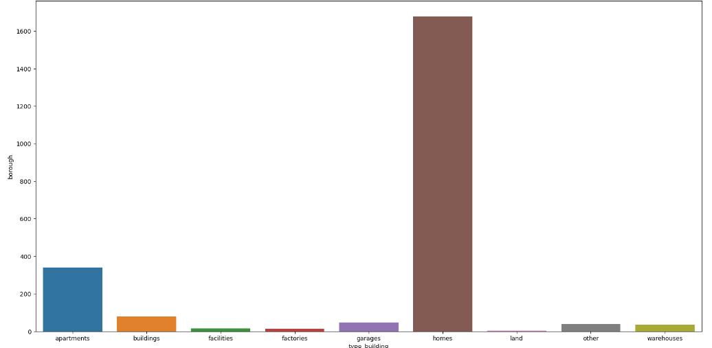
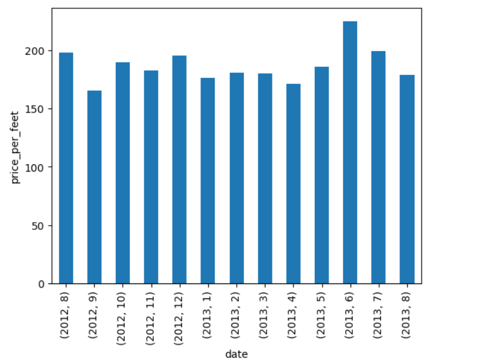
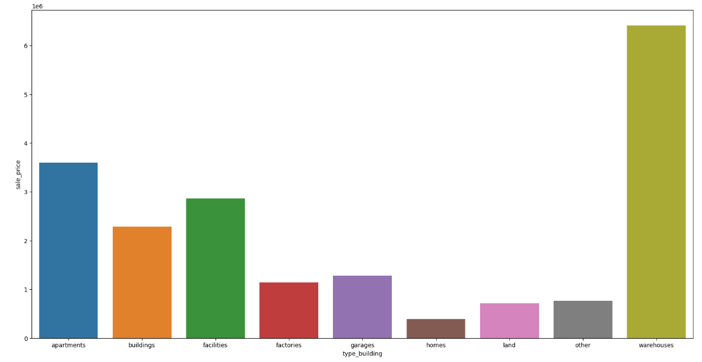

### Представлення графіку залежності кількості будинків та типів будинків, що наявні в районі Bronx міста New York. Найбільша кількість типів будинків на графіку – “Homes” та “Apartments”.

 

### Представлення графіку суми продаж будинків протягом одного року (2012.08. - 2013.08)

### Стовпчаста діаграма представлення залежності суми продаж будинків відповідно до типів будинків в районі Bronx

 

## Висновок:

Проаналізувавши отримані значення можна зробити висновок, що максимальне значення суми продажу будинків припадає на момент стабілізації та зміцненню курсу долара, це свідчить про збільшення попиту на покупку нерухомості. Найбільший попит на покупку нерухомості за апартаментами, при середній кількості отримують найбільшу суму продажів.

