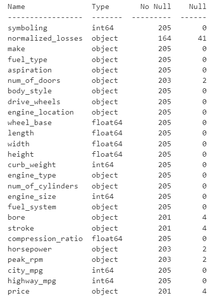
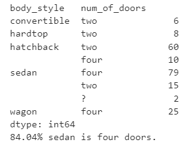
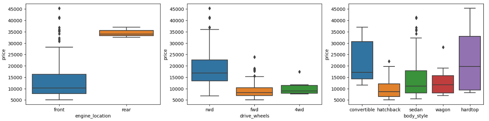
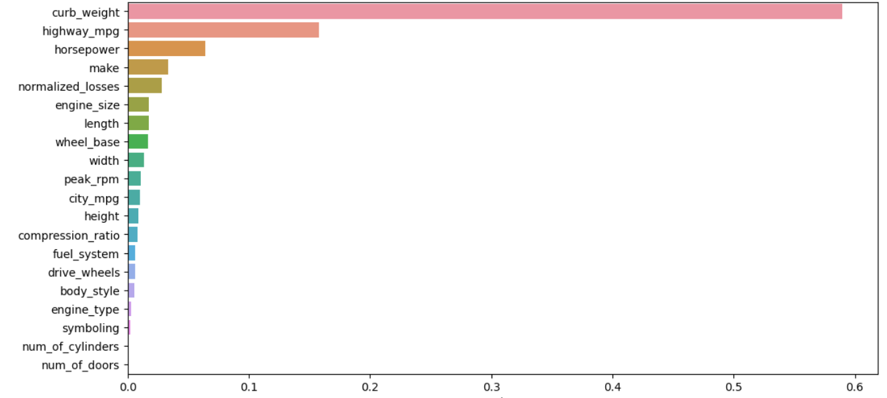
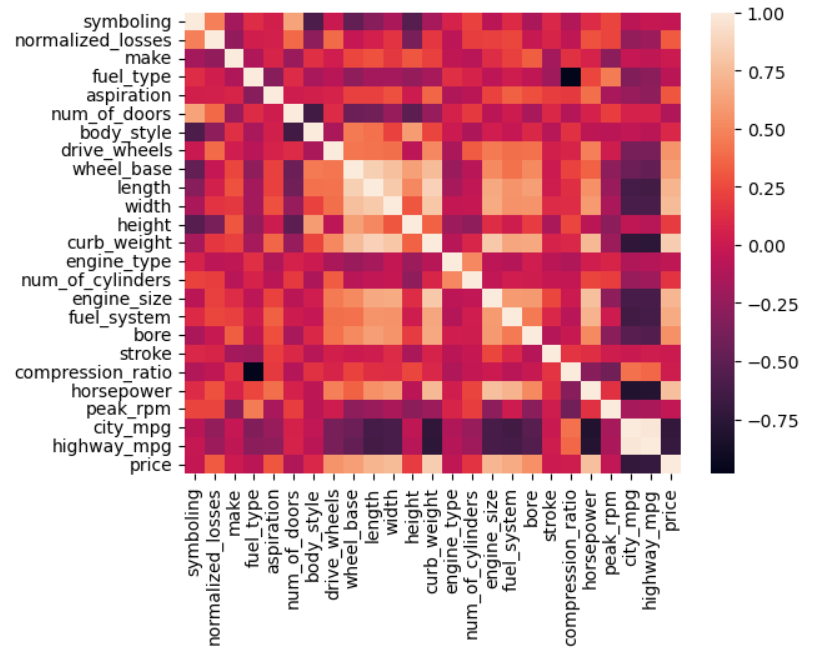

## Аналіз даних
### Під час дослідження даного дата фрейму було вирішено відкинути нульові значення ціни, замінити всі числові значення середніми, а рядкові значення обробляти окремо.

 

### 84.04% Седанів чотиридверневі, тому пропущені дані для кількості дверей будуть замінені на чотири.

## Кореляція
### Після кореляції даних з представлених 26 залишилася 21 ознака, а також визначено 3 найважливіші ознаки.
* Symboling has correlation 0.036, p-value is 0.6331842154850545
* Normalized losses has correlation 0.317, p-value is 1.4352759788069227e-05
* Make has correlation 0.005, p-value is 0.9465789197062073
* Num of doors has correlation 0.122, p-value is 0.10254970734462912
* Body style has correlation 0.085, p-value is 0.25421650817357294
* Drive wheels has correlation 0.565, p-value is 1.5008084787375338e-16
* Wheel base has correlation 0.612, p-value is 7.210669291835463e-20
* Length has correlation 0.716, p-value is 1.3237649365440924e-29
* Width has correlation 0.745, p-value is 4.483940735629761e-33
* Height has correlation 0.187, p-value is 0.012055937204577285
* Curb weight has correlation 0.838, p-value is 1.3532161301065677e-48
* Engine type has correlation 0.053, p-value is 0.4819564774757745
* Num of cylinders has correlation 0.155, p-value is 0.03756021162069747
* Engine size has correlation 0.725, p-value is 1.1540207363299491e-30
* Fuel system has correlation 0.671, p-value is 7.219421668533878e-25
* Compression ratio has correlation 0.022, p-value is 0.766261136862567
* Horsepower has correlation 0.769, p-value is 2.0073201202419802e-36
* Peak rpm has correlation 0.046, p-value is 0.5410315199111934
* City mpg has correlation 0.714, p-value is 2.591260715545443e-29
* Highway mpg has correlation 0.699, p-value is 1.0327686400384447e-27

### З наступних характеристик автомобіля можна виділити найбільш впливові:
* <b>Curb weight</b> feature vs Price is 0.838, p-value is 1.3532161301065677e-48 
* <b>Horsepower</b> feature vs Price is 0.769, p-value is 2.0073201202419802e-36 
* <b>Engine size</b> feature vs Price is 0.725, p-value is 1.1540207363299491e-30 
* City mpg feature vs Price is 0.714, p-value is 2.591260715545443e-29 
* Highway mpg feature vs Price is 0.699, p-value is 1.0327686400384447e-27 
* Fuel system feature vs Price is 0.671, p-value is 7.219421668533878e-25 

## Візуалізація
### Коефіцієнт витрати палива в місті і за містом зростає, а ціна знижується. Зворотна ситуація з розміром двигуна, зі збільшенням розміру зростає ціна:

 

### Відповідно до діаграми вище, автомобілі з заднім розташуванням двигуна мають середню ціну 35 000, автомобілі з переднім двигуном варіюються в ціні від 8 000 до 30 000, а середня ціна становить близько 10 000. Але є невелика кількість, яка виходить за межі їхньої таблиці. ціна коливається від 30 тис. до понад 45 тис

### Ведучі колеса дорогих автомобілів мають задньопривідний тип, середня кількість становить близько 17 000, а більша кількість зосереджена від 14 000 до приблизно 23 000

 

### Використовуючи потужні моделі ML на основі дерева (випадковий ліс), обчисліть функції важливості:

 
