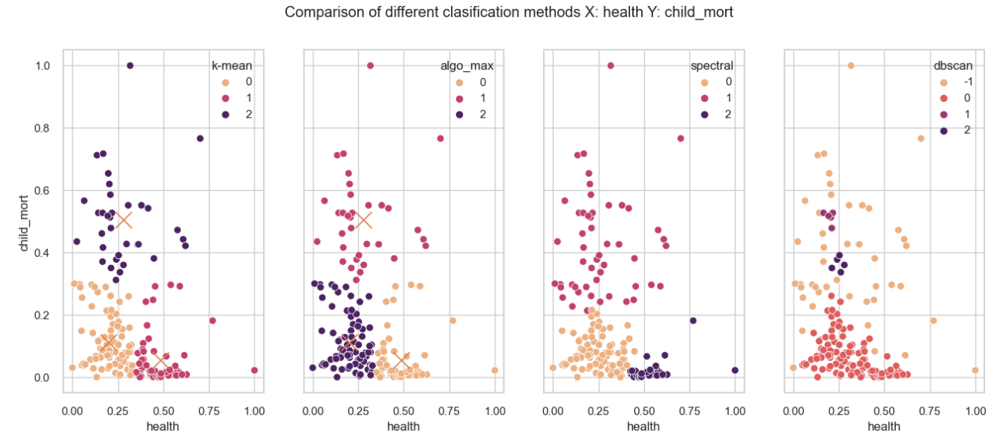
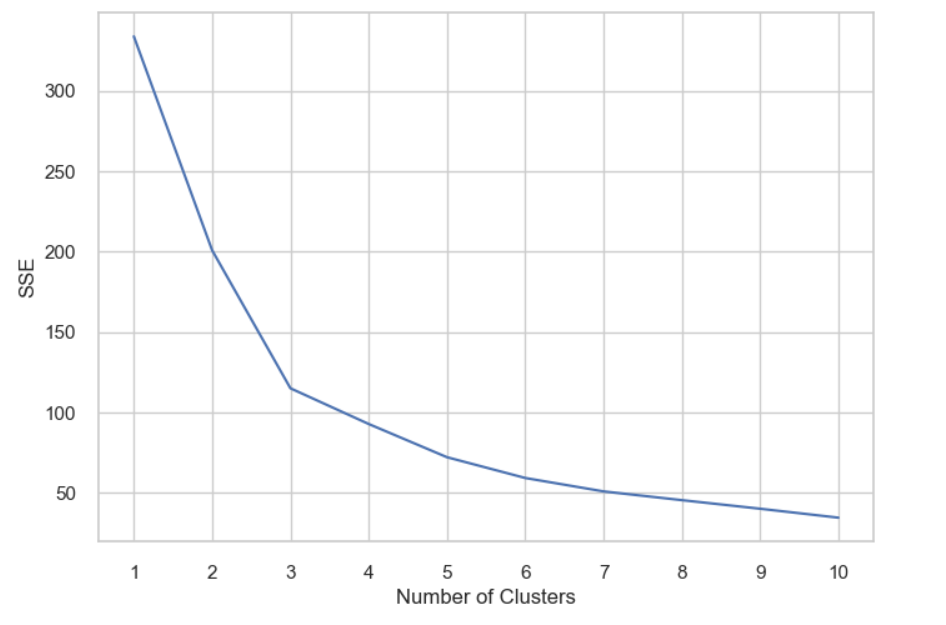
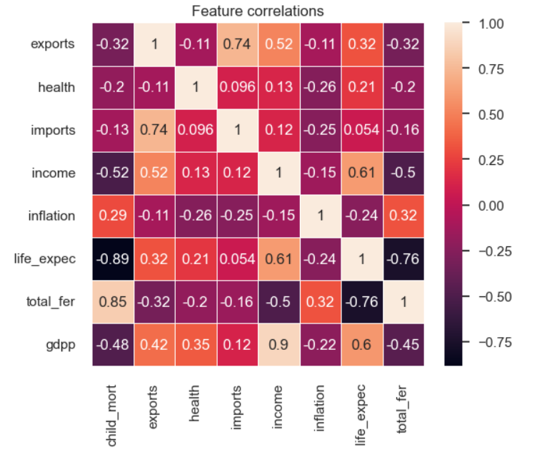
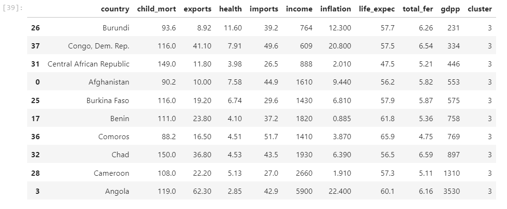

## Перевірка різних методів кластерізації:

### За графіками кластерів наглядно видно що метод Dbscan не підходить, найкращими методами можно виявити спектральний метод та k-mean очікування-максимізації. 
### Використовуючи алгоритм k-means метод локтя побудуємо всі наступні графіки.

## Кластерізація характеристик за методом локтя:

## Розрахунок корелярії характеристик:

## Результат кластерізації, фільтрації даних:

### Із результатов кластеризації бачимо список країн, які більш за все потребують допомоги.
